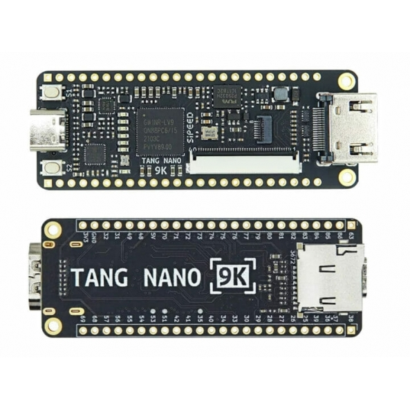

# Tang-nano-9k-projects

In order to learn the Verilog hardware description language, I decided to buy the [Tang Nano 9K FPGA](https://wiki.sipeed.com/hardware/en/tang/Tang-Nano-9K/Nano-9K.html) from SiPeed for a variety of reasons. First of all, the price is relatively cheap. In the second place there is quite some information available about the FPGA and how to get started. [Lushay Labs](https://learn.lushaylabs.com/tang-nano-series/) has an amazing blog to uncover this FPGA with plenty of examples and explanation. They also made a Visual Studio Code plugin to easily get started with an open source toolchain to program the FPGA which works flawlessly. Be sure to check out their blog to get your program environment up and running or to learn more.

